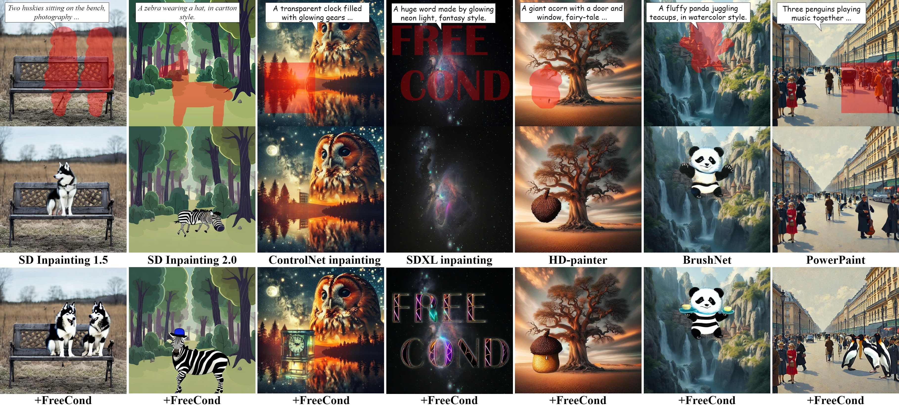
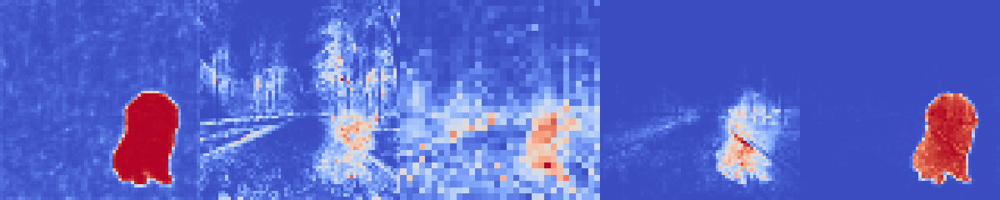
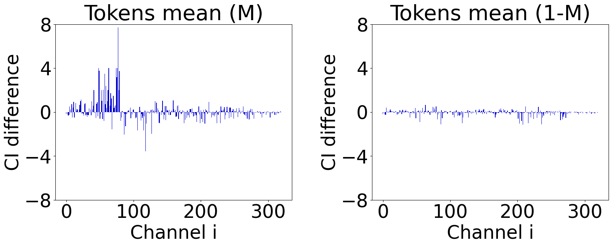

# FreeCond: A Free Lunch for Input Conditions in Text-Guided Inpainting
### FreeCond introduces a more generalized form💪 of the original inpainting noise prediction function, enabling improvement👍 of existing methods—completely free of cost0️⃣!

### Key Features of This Repository:
* ✅ **Unified Framework**: Supports state-of-the-art (SOTA) text-guided inpainting methods in a single cohesive framework.
* ✅ **Flexible Interaction**: Offers both interactive tools (Jupyter notebooks, Gradio UI) and Python scripts designed for evaluation purposes.
* ✅ **Research Support**: Includes visualization tools used in our research papers (*i.e.* self-attention, channel-wise influence indicator, IoU score) to facilitate further exploration.

## 🦦0. Preparation
```
conda create -n freecond python=3.9 -y
conda activate freecond
pip install -r requirements.txt

# (optional) SAM dependency for IoU Score computation
curl --proto '=https' --tlsv1.2 -sSf https://sh.rustup.rs | sh
pip install git+https://github.com/facebookresearch/segment-anything.git
wget https://dl.fbaipublicfiles.com/segment_anything/sam_vit_l_0b3195.pth -P data/ckpt
```
### Supported Features 🙆‍♀️
The freecond virtual environment currently supports:

* Stable Diffusion Inpainting (via diffusers)
* ControlNet Inpainting (via diffusers)
* HD-Painter
### Unsupported Features 🙅‍♀️
The following models are **not directly supported** in this environment. We have reimplemented their code in this repository, but **you need to manually switch to their respective environments and load the pretrained weights provided by the authors**:

* PowerPaint
* BrushNet
### Acknowledgments 🤩🤩🤩
This repository is built upon the following open-source projects. We sincerely appreciate their contributions:

* Diffusers: [Hugging Face Diffusers](https://github.com/huggingface/diffusers)
* HD-Painter: [Picsart AI Research - HD-Painter](https://github.com/Picsart-AI-Research/HD-Painter)
* PowerPaint: [OpenMMLab - PowerPaint](https://github.com/open-mmlab/PowerPaint)
* BrushNet: [Tencent ARC - BrushNet](https://github.com/TencentARC/BrushNet)
## 🐾1. Run

**(The default output of freecond_app.py by using SDXL inpainting)**

With the environment installed, directly run the following script, to interactively utilizing the FreeCond framework
```
# ipynb support
freecond_demo.ipynb
```
```
# gradio app support
python freecond_app.py
```
## 🤓2. For Research



Due to code optimizations, certain random seed-related functionalities may behave differently compared to our development version 😢. As a result, some outputs might slightly differ from the results reported in our research paper.
```
# Metrics evaluation
freecond_evaluation.py --method "sd" --variant "sd15" --data_dir "./data/demo_FCIBench" --data_csv "FCinpaint_bench_info.csv"
```
```
# Visualization
self_attention_visualization.ipynb
CI_visualization.ipynb
```